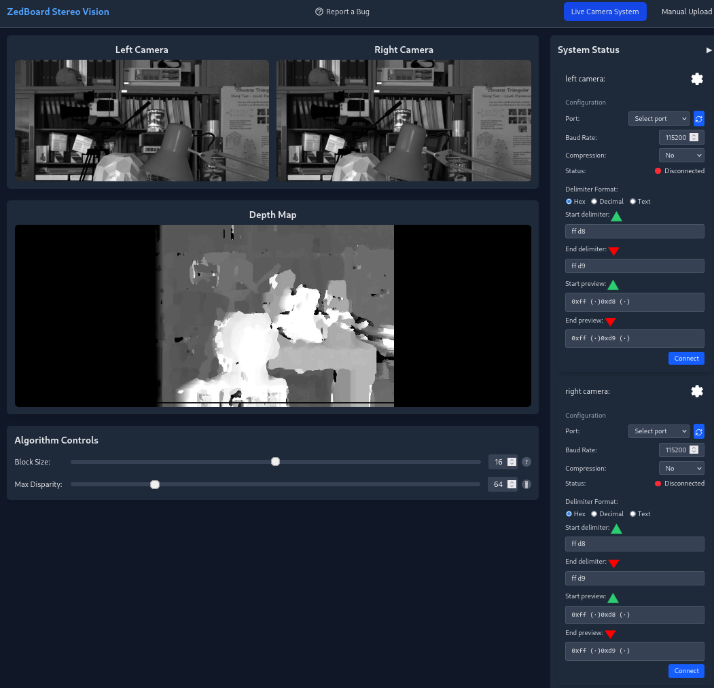

[]()# steroscopic-hardware

[](https://builtwithnix.org)


[](https://builtwithnix.org)


MVP Software Implementation WebUI:


Steroscopic Depth Map in HW

Downlaod the latest release [here](https://github.com/conneroisu/steroscopic-hardware/releases)

## Webserver

The webserver is a simple go server that connects to the two zedboards, streams their feeds to a browser, and calculates and displays the depth map.

### Usage

Included in the repository is a prebuilt webserver binary. (In the release section)

To run it, simply download the respective binary for your platform and run it.

### Development

#### Simple

To develop the webserver, you need to have the following installed:

- [Go](https://go.dev/doc/install)

Then, run the following commands (from the root of the repository):

```bash
# Install dependencies
go mod tidy

# Run Code Generation Step
go generate ./...

# Run the webserver
go run main.go
```

This will start the webserver on port 8080.

#### Advanced

To develop using the development environment, you need to have [nix](https://nixos.org/download.html) installed.

- Best [Nix](https://docs.determinate.systems/) Installer
- [direnv](https://direnv.net/docs/installation.html)

From the root of the repository, run the following commands:

```bash
direnv allow
```

This will allow direnv to automatically load the environment variables and development dependencies.
